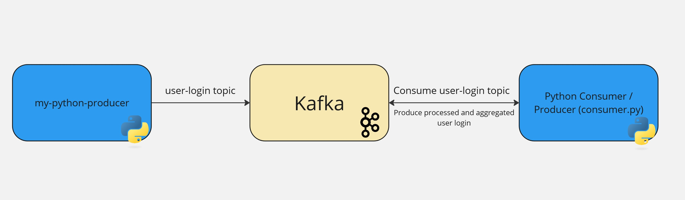

# Kafka-Demo

⚠️ **Disclaimer**  
This project was developed with the assistance of generative AI tools.

## Overview
Real-time streaming data pipeline using **Kafka** and **Docker**. Streaming data from Kafka is consumed in Python where aggregation metrics are calculated and reingested in a Kafka. The following new topics are produced:

processed-user-login:
Cleans user data by replacing missing fields with 'unknown'

aggregated-user-login:
Every 10 seconds aggregations of key data points are sent to this topic to view trends.



## Prerequisites

- **Docker Desktop** (https://docs.docker.com/get-docker/)

For Local Development
- **Python 3.9+** (https://www.python.org/)
- **Microsoft Visual C++ 14.0 Build Tools** (https://visualstudio.microsoft.com/visual-cpp-build-tools/)
- **Librdkafka: needed for pip install confluent-kafka**(https://github.com/confluentinc/librdkafka/releases)

## Project Setup

### Configure environment variables
Set custom variables as needed 

.env.prod is preconfigured for docker environment.

BOOTSTRAP_SERVERS=kafka:9092

KAFKA_TOPIC=user-login

GROUP_ID=user-login-consumer-group

### Docker compose set up
Kafka, the data generator, and the kafka consumer are build into the docker compose file.

To start:

```bash
docker compose up --build
```

Kafka will be running on `localhost:29092` for local development, and `kafka:9092` in docker. The data generator will produce messages in the `user-login` topic.

The python Kafka consumer will run in it's own Docker container, consuming `user-login` and producing `processed-user-login` and `aggregated-user-login`

Sample output:

```
Kafka Consumer is running and consuming data...
Processed Event: {'user_id': 'user-12', 'app_version': '1.4', 'device_type': 'device-1', 'locale': 'en-US', 'event_time': '2024-06-26 12:15:01'}
Sent to 'processed-user-login': {'user_id': 'user-12', 'app_version': '1.4', 'device_type': 'device-1', 'locale': 'en-US', 'event_time': '2024-06-26 12:15:01'}

--- Insights ---
Most Popular App Versions: [('1.4', 10), ('1.3', 7), ('1.2', 5)]
Most Popular Device Types: [('device-1', 15), ('device-0', 12)]
Most Common Locales: [('en-US', 20)]
----------------
Sent to 'aggregated-user-login': {'most_popular_app_versions': [('1.4', 10), ('1.3', 7), ('1.2', 5)], 'most_popular_device_types': [('device-1', 15), ('device-0', 12)], 'most_common_locales': [('en-US', 20)], 'timestamp': '2024-06-26 12:15:10'}
```

### Local Environment Setup

Comment line 9 in consumer.py for local testing

After installing local environment prerequisites,

### Install python dependencies

```bash
pip -r install requirements.txt
```

### Run the consumer

```bash
python consumer.py
```